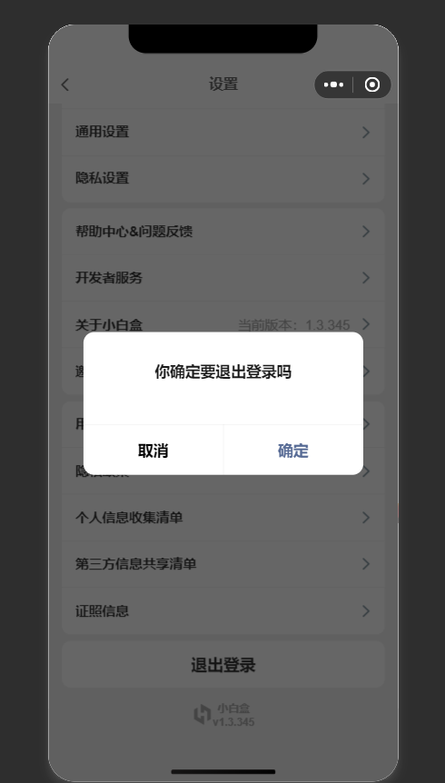

## 期末实训任务：

> 写一个微信小程序

### 借助colorUI模仿小黑盒app（纯手搓）
>2024.12.27

**未登录**：

  “我的”界面看不到用户信息，和部分功能,只有默认界面，只能使用右上角设置按钮，设置界面同样只有部分信息

***

**登录中：**

1. 点击头像旁边的文字可以进行登录

2. 手机号必须是11位数，填写错误会显示错误提示，只有正确显示手机号才可以获取验证码

3. 最下方的勾选框需要勾选，不勾选会弹窗，点击“不同意”，和“仍然体验”，将会返回未登录界面状态

4. 验证码获取界面，验证码必须是4位数，,填写错误会显示错误提示，填写正确会立即跳转到已登录的界面,***验证码***就是***1234***

   

   ***

**已登录：**

1. 可以看到了我的界面的所有内容

2. 设置页面也新添加了很多内容，设置页面可以退出登录

3. 下滑可以显示进度条动画，刷新页面可再次显示

   

***

### 建议：

* 在iphone12/13（Pro)下打开，字体16
* 用手机进行预览，很多照片显示不出来
* 很多点了显示***版本不支持***都是没写的功能，都用这个替代了
